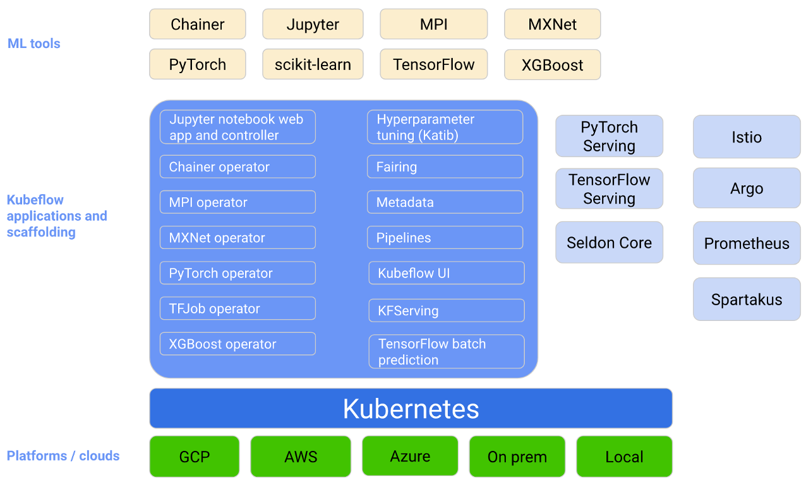
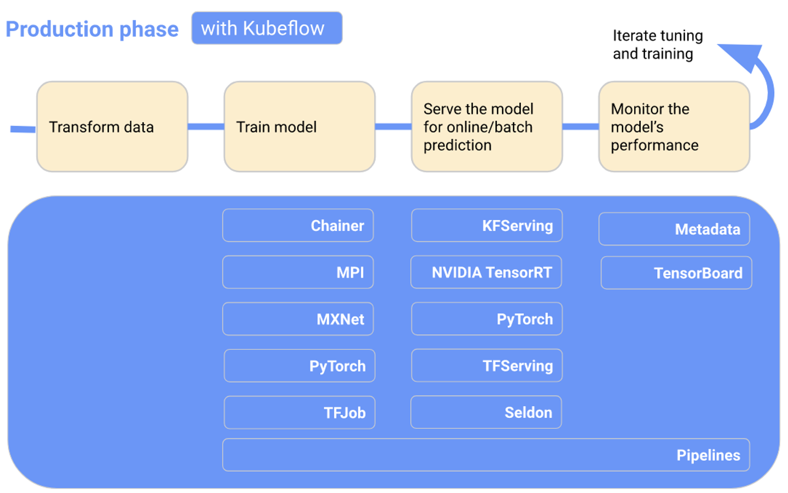

# Intro 
## DevOps
1. 등장배경 : 개발팀과 운영팀의 분리로 인한 문제 발생
조직간 원활한 소통의 어려움 > 서비스 품질 저하

2. 정의 :
개발팀과 운영팀의 협업으로 전체 Life Cycle을 함께 관리하자는 철학 또는 운동
개발팀과 IT팀이 더 빠르고 안정적으로 SW를 빌드 & 릴리즈 할 수 있도록
두 팀간의 프로세스를 자동화하는 일련의 과정

3. CI / CD :
CI: Continuous Integration
CD: Continuous Delivery and Continuous Deployment

## MLOps

- ML팀과 운영팀의 문제를 해결하기 위한 방법 e.g. Data Drift, Schema Drift, Data Skew, Concept Drift…

### DevOps & MLOps
- DevOps: 개발팀에서 개발한 기능이 정상적으로 배포될 수 있는지 확인
- MLOps:    ML팀에서 개발한 모델이 정상적으로 배포될 수 있는지 확인

최근에는 ML팀이 직접 서비스를 운영할 수 있게 도와주는 과정까지 포함

## k8s
다수의 컨테이너를 운영하기 위한 Container Orchestration System

### 구성 모듈
1. Node : Kubernetes의 hardware 요소 중 가장 작은 단위
2. Cluster : 여러 대의 Node를 모아서 하나의 Cluster로 구성함 ,K8s에서는 각 Node의 상태를 고려하여 배포할 프로그램을 유연하게 관리함
3. Persistent Volume : Cluster에 배포된 application은 container로 실행되므로 내부에 저장된 데이터는 휘발될 수 있음 Local 또는 cloud storage를 cluster에 mount한 개념
4. Pods : K8s의 기본 실행 단위, K8s는 container를 직접 실행하지 않고 pod이란 형태로 감싸서 실행
```
Pod 내의 container 끼리는 동일한 자원과 local network를 공유
Load balancing & Failure resistance: Pod 단위로 서비스의 사본을 여러 개 실행하여 부하를 분담하거나, 서비스가 중단되는 것을 방지
Scaling up & down의 단위이므로 Pod 내에 container 수를 최소화할 것을 권장(side-cars)
```
5. Deployments
Pod만으로도 app container 실행 가능, 그러나 관리를 쉽게 하기 위해 deployment라는 레이어를 한 층 더 쌓아서 관리
```
Deployment는 몇 개의 Pod을 항상 띄워둘 것인지 선언하고,
control plane에서는 여기서 선언된 개수를 유지하도록 조절함
Pod을 어느 Node에서 실행할 지는 control plane의 scheduler가 결정
```
6. Namespaces
```
Virtual sub-cluster, Cluster를 가상의 클러스터로 쪼개어, 쪼개진 클러스터 간에는 서로 영향을 끼치지 않도록 함.
하나의 클러스터에서 여러 조직 또는 프로젝트가 작업할 경우
또는 개발 및 운영 단계(Development, Testing, Production)별로 구분할 필요가 있는 경우에 사용
K8s에서는 기본적으로 4가지 namespace가 생성됨(default, kube-system, kube-public, kube-node-lease)
```

## k8s
- 서비스 디스커버리와 로드 밸런싱 : DNS 이름을 사용하거나 자체 IP 주소를 사용하여 컨테이너를 노출
- 스토리지 오케스트레이션 : 로컬 저장소, 공용 클라우드 공급자 등과 같이 원하는 저장소 시스템을 자동으로 탑재 
- 자동화된 롤아웃과 롤백 : 원하는 상태를 서술하고 현재 상태를 원하는 상태로 설정한 속도에 따라 변경 가능 
- 자동화된 빈 패킹 : 각 컨테이너가 필요로 하는 CPU와 메모리(RAM)를 제공 
- 자동화된 복구(self-healing) : 실패한 컨테이너를 다시 시작하고, 컨테이너를 교체
- 시크릿과 구성 관리 : 암호, OAuth 토큰 및 SSH 키와 같은 중요한 정보를 저장하고 관리 
## k8s 클러스터 구조

- 쿠버네티스 아키텍처에서 클러스터(Cluster)란 컨테이너 형태의 애플리케이션을 호스팅하는 물리/가상 환경의 노드들로 이루어진 집합
- Node는 하나의 가상머신을 의미합니다. 
쿠버네티스는 컨테이너화 된 애플리케이션을 실행하는 Worker Node와 그러한 Worker Node를 관리하는 Master Node로 구성됩니다.

## Master / Worker Node


### Master Node


### Worker Node


## Kubeflow



## Kubeflow workflow




### 웹 실습
웹 실습환경 https://labs.play-with-k8s.com/

## Kubeflow
###  설치
1. [kubectl](https://kubernetes.io/ko/docs/tasks/tools/install-kubectl-linux/)  : 생성한 클러스터에 요청을 보내기 위한 클라이언트 툴
2. [minikube](https://minikube.sigs.k8s.io/docs/start/) : k8s 클러스터를 구성하기 하기 위해 사용되며 k8s에 비해 경량화되어 일반 데스크탑에서도 사용이 가능함 
3. [Kustomize](https://github.com/kubernetes-sigs/kustomize/releases/download/v3.2.0/kustomize_3.2.0_darwin_amd64) : k8s 네트워크에 커스텀된 Pod 모듈을 추가할 수 있음 Kubeflow를 설치하는데 사용됨
4. [kubeflow](https://github.com/kubeflow/manifests ) : Manifest를 활용하여 Kubeflow 네임스페이스 내 katib, 파이프라인을 설치할 수 있음

### 실행
UI만 실행하는 방법
1. minikube 클러스터(EX 이름 : mlops) 생성
2. kubeflow Namespace 생성
3. Istio / Cert-manager /Dex / OIDC AuthService  Namespace 생성
4. Kubeflow 네임스페이스에 UI 설치 kustomize build apps/centraldashboard/upstream/overlays/istio | kubectl apply -f – 
5. UI 포트 열기

### 삭제
```sh
# minikube
minikube stop
minikube status
minikube delete
minikube delete -all

# kubectl
kubectl config get-clusters
kubectl config delete-cluster my-cluster 
kubectl config delete-context my-cluster-context
```
