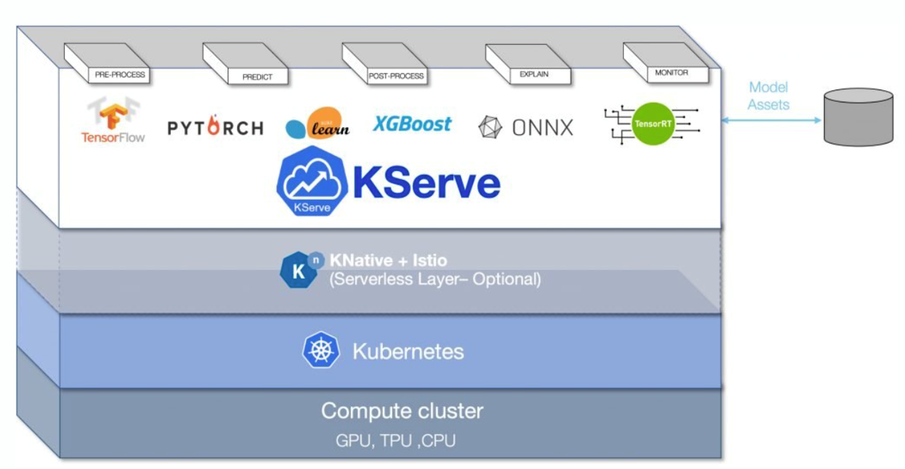
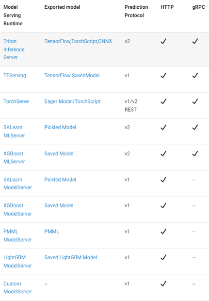
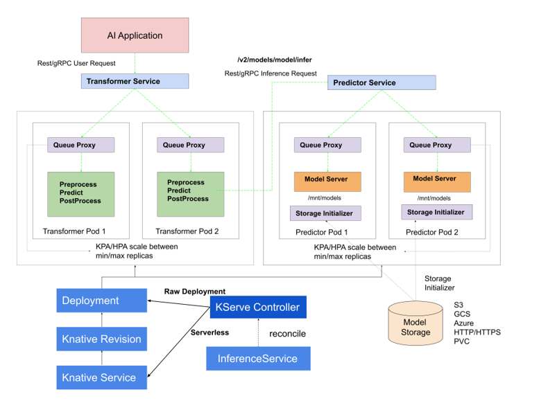
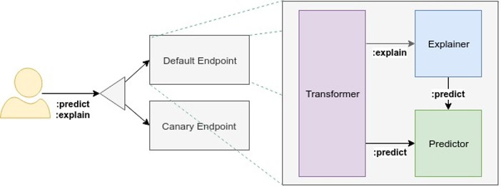

# Serving

2021/09 까지 Kubeflow 안의 Component인 KFServing.

그 이후 독립적으로 취급,유지하게 되었고 [KServe](https://github.com/kserve/kserve)로 이름을 변경.

다양한 모델 서빙 런타임에서 API를 제공

 
[더보기](https://kserve.github.io/website/0.9/modelserving/v1beta1/serving_runtime/)

다양한 장점이 존재
- Scale to and from Zero
- Request based Autoscaling on CPU/GPU
- Revision Management
- Optimized Container
- Batching
- Request/Response logging
- Traffic management
- Security with AuthN/AuthZ
- Distributed Tracing
- Out-of-the-box metrics
- Ingress/Egress control

# Control Plane

 
[더보기](https://kserve.github.io/website/0.9/modelserving/control_plane/)

InferenceService를 관리조정한다.
KServe Controller를 통해 service/ingress resource/model server container/model agent container for request response logging,batching/model pulling 을 한다.

# Data Plane

 
[더보기](https://kserve.github.io/website/0.9/modelserving/data_plane/)

Predictor: 모델과 모델 서버 

Explainer: 모델을 통해 만들어진 결과물과 해석, explanation을 제공한다.

Transformer: 전/후 처리를 진행한다.

# 예제 
https://github.com/myoh0623/kubeflow/tree/master/section7_kserve

https://kserve.github.io/website/0.9/modelserving/v1beta1/transformer/torchserve_image_transformer/#extend-modelserver-and-implement-prepost-processing-functions

# 출처

https://kserve.github.io/website/0.9/modelserving/control_plane/#control-plane-components

https://youtu.be/2yLXrXG3n-U

https://youtu.be/C03F3NvOD9Y

https://github.com/myoh0623/kubeflow/blob/master/section7_kserve/0_tutorial.ipynb

https://devocean.sk.com/blog/techBoardDetail.do?ID=163739

https://github.com/kserve/kserve
