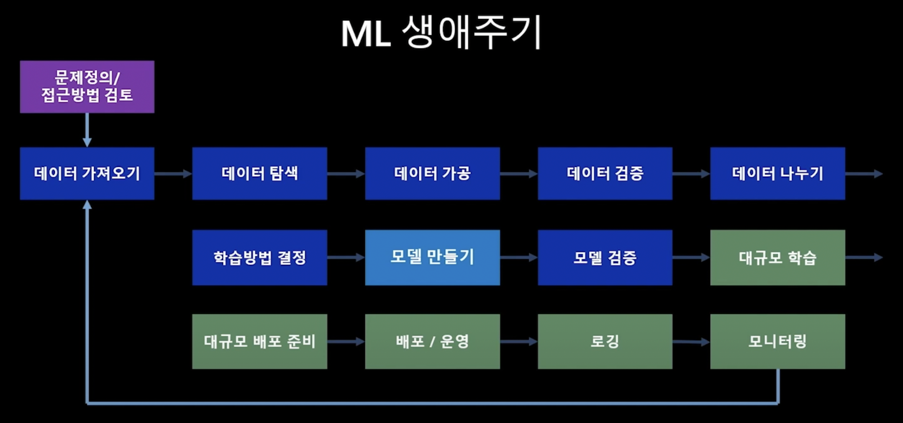

# Chapter 1. Motivation for MLOps

## ML 생애주기
우리가 Machine learning(ML)을 이용한 솔루션을 생각할 때 흔히 하는 착각이 있다.
그건 바로 무조건적으로 좋은 모델을 만들어서 사용하면 되는것 아닌가? 하는 생각이다. 

하지만 실제 ML에는 모델을 만드는 일이 전부가 아니라 문제에 필요한 데이터를 정의, 수집, 준비(가공)하는 과정이 필요하다.

즉 하나의 ML 서비스가 만들어지기 위해서는 **모델을 어떻게 만들 것인가? -> 모델을 어떻게 평가할 것인가? → ML 모델을 서비스로 만들 것인가?** 와 같은 노력의 과정이 필요하다. 게다가 위 과정을 거쳐서 모델이 만들어져서 서비스로 올라간다고 끝나는게 아니다. 
ML의 생애 주기는 배포된 서비스를 지속적으로 모니터링하고, 위 과정을 다시 돌아서 모델을 재학습, 재배포하는 과정까지 모두 포함한다.

## DevOps vs MLOps

## MLOps의 이점

# Chapter 1. MLOps Lifecycle1:데이터준비
## 문제정의데이터확보 
## 데이터 연계 
## 데이터셋 공유 및 재사용 
## 데이터 탐색 
## 데이터 가공
